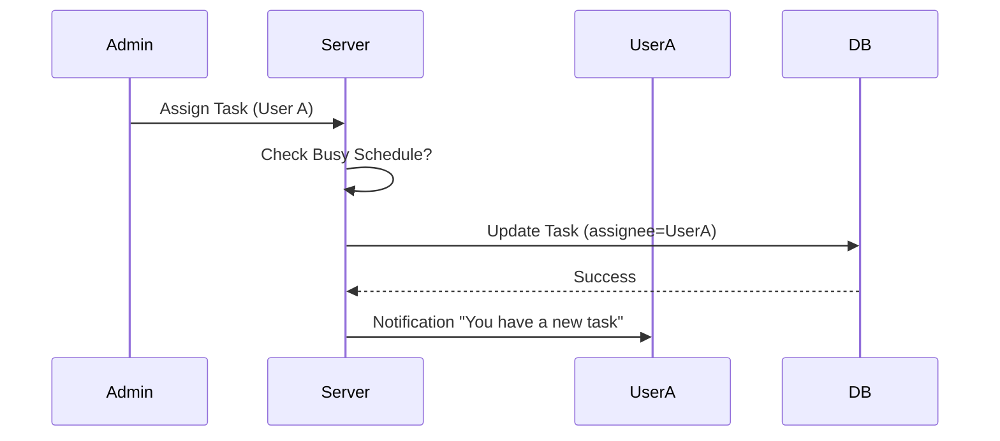
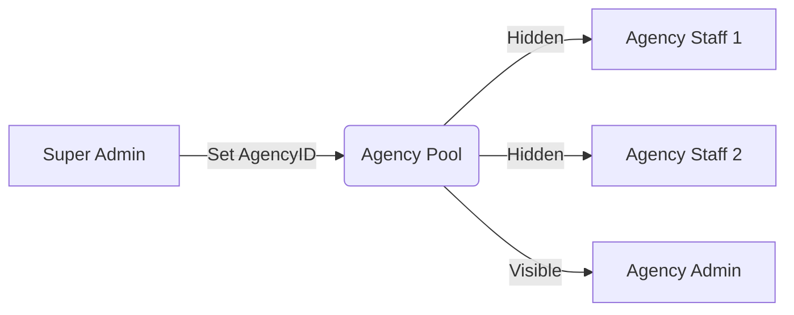
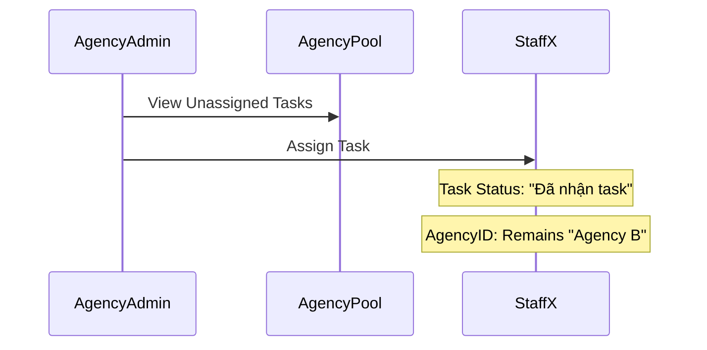

# 🧠 Task Logic Breakdown & Architecture

Tài liệu này giải thích chi tiết cơ chế xử lý (Logic Flow) của hệ thống Task, bao gồm luồng giao việc, bàn giao phân cấp (Agency), và các quy tắc xử lý dữ liệu.

## 1. Tổng Quan Mô Hình

Hệ thống sử dụng mô hình **Lai (Hybrid)** giữa quản lý trực tiếp và phân cấp Đại Lý.

-   **Global Pool**: Kho việc chung của hệ thống (Super Admin quản lý).
-   **Agency Pool**: Kho việc riêng của từng Đại Lý (Đã được Admin giao về).
-   **Personal Queue**: Kho việc của từng nhân viên (Đã được giao đích danh).

---

## 2. Admin Giao Việc Trực Tiếp (Direct Assignment)
**Đối tượng**: Super Admin giao cho Nhân viên Nội bộ (Hoặc nhân viên Đại lý nhưng quản lý trực tiếp).

### Logic Flow
1.  **Input**: Admin chọn task, chọn nhân viên `User A` từ dropdown.
2.  **Xử lý Server**:
    *   Set `assigneeId` = `User A.id`.
    *   Set `assignedAgencyId` = `User A.agencyId` (Nếu User A thuộc Agency nào đó).
    *   Set `status` = `"Đã nhận task"`.
    *   Set `deadline` = Input deadline.
3.  **Hệ quả**: Task xuất hiện ngay trong Tab "Đang làm" của `User A`.

### Mermaid Diagram

---

## 3. Admin Giao Cho Đại Lý (Agency Handover)
**Đối tượng**: Super Admin giao việc trọn gói cho một Đại lý (Outsource), không quan tâm nhân viên cụ thể nào làm.

### Logic Flow
1.  **Input**: Admin tạo task, trường `Assignee` để trống, nhưng chọn `Agency` (Nếu có chức năng này, hiện tại Admin thường giao cho *Chủ Đại Lý* hoặc chọn từ Pool).
    *   *Thực tế Code hiện tại*: Admin chọn `Assignee` là một nhân viên thuộc Agency -> Hệ thống tự fill `assignedAgencyId`.
    *   *Logic chuẩn Agency*: Admin có thể không chọn Assignee, chỉ set `assignedAgencyId`.
2.  **Xử lý Server** (Nếu assign vào Pool):
    *   Set `assigneeId` = `NULL`.
    *   Set `assignedAgencyId` = `Agency B.id`.
    *   Set `status` = `"Đang đợi giao"`.
3.  **Hệ quả**:
    *   Task biến mất khỏi Global Queue.
    *   Task xuất hiện trong **Agency Portal** của Đại lý B.
    *   Nhân viên Đại lý B **CHƯA THẤY** task này (Do chưa ai nhận).

### Mermaid Diagram

---

## 4. Đại Lý Phân Phối Task (Agency Internal Distribution)
**Đối tượng**: Agency Admin (Chủ đại lý) giao việc cho nhân viên của mình (`Agency Staff`).

### Logic Flow
1.  **Input**: Chủ đại lý vào "Agency Portal", thấy task trong Pool. Bấm Assign cho `Staff X`.
2.  **Xử lý Server**:
    *   Kiểm tra: `Staff X` có thuộc `assignedAgencyId` của task không? (Scope Check).
    *   Set `assigneeId` = `Staff X.id`.
    *   **GIỮ NGUYÊN** `assignedAgencyId` = `Agency B.id`. (Quan trọng: Task vẫn thuộc về Đại lý này).
    *   Set `status` = `"Đã nhận task"`.
    *   Set `status` = `"Đã nhận task"`.
3.  **Hệ quả**: Task chuyển từ Agency Pool sang Personal Queue của `Staff X`.

> **Lưu ý**: Task đang ở trạng thái **Tạm ngưng (PAUSED)** cũng có thể được giao lại (Re-assign) về trạng thái **Đã nhận task (ASSIGNED)**.

---

## 5. Quy Trình Trả Task & Thu Hồi (Unassign & Recall)

Đây là phần phức tạp nhất vì có nhiều kịch bản.

### Kịch Bản A: Agency Admin thu hồi task từ nhân viên (Re-assign)
*   **Hành động**: Chủ đại lý bấm "Unassign" nhân viên X.
*   **Logic**:
    *   Set `assigneeId` = `NULL`.
    *   **GIỮ NGUYÊN** `assignedAgencyId` = `Agency B.id`.
    *   Task quay trở về **Agency Pool**. Chủ đại lý có thể giao người khác.

### Kịch Bản B: Super Admin thu hồi task từ Đại lý (Revoke)
*   **Hành động**: Super Admin bấm hủy giao cho Đại lý B.
*   **Logic**:
    *   Set `assigneeId` = `NULL`.
    *   Set `assignedAgencyId` = `NULL`.
    *   Task quay trở về **Global Pool**. Super Admin giao lại từ đầu.

### Kịch Bản C: Phạt (Penalty System) - Tự động
*   **Trigger**: Task quá hạn deadline.
*   **Logic**:
    *   Set `isPenalized` = `TRUE`.
    *   Set `assigneeId` = `NULL`.
    *   Set `assignedAgencyId` = `NULL` (Reset hoàn toàn về kho chung để xử lý nhanh).
    *   Set `deadline` = `NULL`.
    *   Trừ điểm Staff (-10).
    *   Thông báo cho Super Admin.

---

## 6. Dữ Liệu & Trạng Thái (Database States)

Bảng trạng thái dữ liệu (DB Record) qua các giai đoạn:

| Giai Đoạn | `assigneeId` | `assignedAgencyId` | `status` | Vị trí hiển thị |
| :--- | :--- | :--- | :--- | :--- |
| **Mới tạo (Global)** | `NULL` | `NULL` | `Đang đợi giao` | Admin Queue |
| **Giao cho Đại lý** | `NULL` | `AGC_01` | `Đang đợi giao` | Agency Portal (Pool) |
| **ĐL giao Staff** | `USER_A` | `AGC_01` | `Đã nhận task` | User Dashboard |
| **Đang làm** | `USER_A` | `AGC_01` | `Đang thực hiện` | User Dashboard (Working) |
| **Unassign (Bởi ĐL)**| `NULL` | `AGC_01` | `Đang đợi giao` | Agency Portal (Pool) |
| **Phạt (Penalty)** | `NULL` | `NULL` | `Đang đợi giao` | Admin Queue (Red Flag) |

---

## 7. Các Trường Hợp Đặc Biệt (Edge Cases)

### Race Condition (Đã khắc phục bằng Optimistic Locking)
*   **Tình huống**: Admin bấm "Unassign" đúng lúc Nhân viên bấm "Nộp bài".
*   **Xử lý cũ**: Dữ liệu có thể bị lỗi (Task nộp thành công nhưng không có người nhận).
*   **Xử lý mới**: Hệ thống kiểm tra `version`. Nếu Admin unassign trước -> Lệnh nộp bài của nhân viên bị từ chối (Báo lỗi: "Task đã thay đổi").

### Ghost Agency Task
*   **Tình huống**: Nhân viên tự rời Agency khi đang giữ task.
*   **Xử lý**: Khi remove user khỏi Agency, hệ thống tự động quét các task đang giữ -> Chuyển về Agency Pool (`assigneeId`=NULL).

---

*Tài liệu được trích xuất từ mã nguồn hệ thống ngày 06/02/2026*
